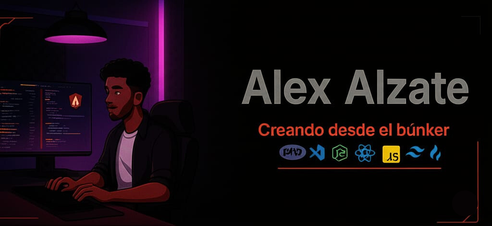

  

<h1 align="center">
👨🏾‍💻 Alexis Alzate
   
  Creando desde el búnker tecnológico
</h1>

  <strong>🚀 Desarrollador Frontend especializado en crear experiencias digitales excepcionales</strong>
   
  <em>Desde mi base de operaciones en Colombia, transformo ideas en código que impacta</em>

  
  
  

  
  ### 🛠️ Arsenal Tecnológico del Búnker
  
  **🎯 Frontend Weapons**
   
  
  
  
  
  
  **⚡ Backend Artillery** 
   
  
  
  
  
  **🎨 Design Systems**
   
  
  
  
  

---

  
  ### 💻 Herramientas de Desarrollo
  
  
  
  
  

## 🏠 Desde el Búnker

<table>
<tr>
<td width="50%">

### 🎯 Mi Misión
Desde mi búnker tecnológico, desarrollo soluciones web que combinan **funcionalidad excepcional** con **diseño elegante**. Cada proyecto es una misión para crear experiencias digitales que impacten.

### 🎓 Credenciales
- **📜 Graduado** en Análisis y Desarrollo de Sistemas  
- **⚛️ Especialista** en React y ecosistema moderno
- **🛠️ Full Stack** con Node.js y PHP
- **💾 NoSQL Expert** con MongoDB
- **🎨 UI/UX** con Tailwind CSS y Bootstrap

</td>
<td width="50%">

### 🚀 Stats del Búnker
- **🔥 Proyecto actual:** E-commerce con 24 componentes
- **📝 Líneas escritas:** 12,000+ en último proyecto  
- **⚡ Tecnologías dominadas:** 8+ frameworks
- **🎯 Enfoque:** Frontend moderno y escalable
- **🌟 Filosofía:** "Los detalles hacen el diseño"

### 🎧 Cuando no estoy en el búnker
- **🎼 Produciendo beats** de música urbana
- **🎹 Creando melodías** en instrumentos  
- **📖 Leyendo la Biblia** diariamente
- **🧠 Estudiando** teoría musical avanzada

</td>
</tr>
</table>

---

  
  ## 🔥 Proyectos Destacados desde el Búnker
  
  ### 🛒 [TechGear Pro - E-commerce](https://github.com/alexis-alzate/techgear-pro)
  **React 18 + Tailwind CSS + 24 Componentes**
   
  
  
  
  
  ### 📊 [Admin Dashboard Pro](https://github.com/alexis-alzate/dashboard-react)
  **Sistema de gestión completo con analytics**
   
  
  
  

---

  
  ## 📊 GitHub Analytics del Búnker
  
  
  
  
   
  
  
  

---

  
  ## 🤝 Conectemos desde el Búnker
  
  
  
  
  
  
  ### 💼 ¿Trabajamos juntos?
  **Disponible para oportunidades full-time y proyectos freelance**
  
  
  

---

  
  ### 🌟 "Desde mi búnker, cada línea de código es una misión para crear el futuro digital"
  
  
  
  ⚡ Powered by Colombian innovation desde el búnker tecnológico
  

