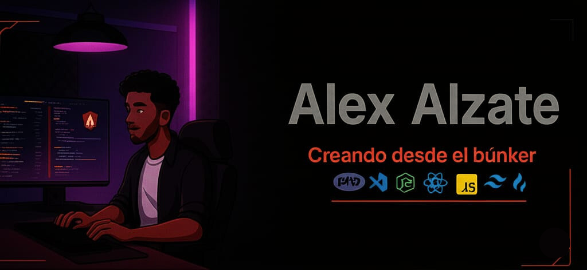

  

<h1 align="center">👨🏾‍💻 Alexis Alzate</h1>

  <strong>Software Developer · Automation · Desktop & Web</strong>
   
  <em>Construyendo software útil desde Colombia 🇨🇴</em>

---

## 🏠 Desde el Búnker

Soy **Alexis Alzate**, desarrollador de software colombiano.

Me gusta tomar problemas reales y convertirlos en herramientas que puedan usarse de verdad: **aplicaciones de escritorio, automatización de procesos y productos web**.

Mi enfoque actual está en **C#, .NET y Python**, mientras sigo aprovechando mi experiencia con **JavaScript, React y desarrollo web**.

> No me interesa coleccionar tecnologías. Me interesa entender cómo funciona un sistema, cómo se conectan sus piezas y cómo construirlo mejor.

---

## 🚀 Proyectos destacados

<table>
<tr>
<td width="50%" valign="top">

### 📸 Zaetta Capture

Aplicación de captura de pantalla para Windows desarrollada en **C# / WinForms**.

Incluye captura mediante atajos, herramientas de anotación, texto, numeración, pixelado, historial local, portapapeles, repetición de regiones e instalador propio.

**Stack principal**  
`C#` · `.NET` · `WinForms` · `Windows`

</td>
<td width="50%" valign="top">

### ⚙️ PlayOps Suite

Suite para automatizar y centralizar procesos operativos que antes requerían trabajo manual.

Incluye monitoreo, cargue de rutas, bitácoras, historial operativo y dashboard.

**Stack principal**  
`Python` · `Tkinter` · `Automatización`

</td>
</tr>
</table>

### 🎧 LUJOURBAN

Tienda de beats construida **desde cero en Next.js** — sin depender de BeatStars ni pagar comisión por venta, con propiedad total de la plataforma.

- Backend en migración a **ASP.NET Core (.NET)**, con **Supabase/PostgreSQL** como base de datos.
- Pagos integrados con **Mercado Pago Checkout Pro** (REST directo + webhooks).
- Función SQL atómica que evita la doble venta de licencias exclusivas.
- Notificaciones automáticas a productores en cada venta, vía **Resend**.

  

---

## 🛠️ Stack & herramientas

### 🧠 Enfoque actual

### 🌐 Web

### 🗄️ Datos & servicios

### 🔧 Herramientas

---

## 🧭 Cómo pienso el desarrollo

Para mí programar no es solamente escribir código.

- 🧩 Entender cómo se divide un sistema en componentes.
- 🔄 Comprender cómo viajan los datos y cómo se conectan las piezas.
- 🏗️ Diseñar soluciones mantenibles en lugar de parches aislados.
- 🐛 Buscar la causa real de un problema antes de corregirlo.
- ⚙️ Detectar procesos repetitivos que vale la pena automatizar.
- 📚 Estudiar el código que construyo para comprender el **por qué**, no solamente el **qué**.

---

## 🎓 Formación & aprendizaje

**Tecnólogo en Análisis y Desarrollo de Sistemas de Información**

Actualmente sigo profundizando en:

`C#` · `.NET` · `Arquitectura de Software` · `Python` · `PostgreSQL` · `APIs` · `Automatización`

---

## 🎧 Fuera del código

Cuando cierro VS Code, normalmente sigo creando de otra forma.

- 🎹 Producción musical
- 🎚️ Mezcla y audio
- 🎼 Creación de beats
- 📖 Lectura y aprendizaje
- ✝️ Fe
- 🧠 Tecnología

El desarrollo de software y la música tienen algo en común que me encanta: **ambos son sistemas construidos a partir de relaciones, estructura y detalles**.

---

## 📊 GitHub

  

---

## 🤝 Conectemos

---

### ⚡ Desde el búnker, construyendo una idea a la vez.

  

🇨🇴 Built from Colombia

